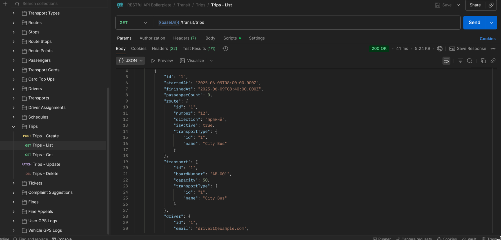
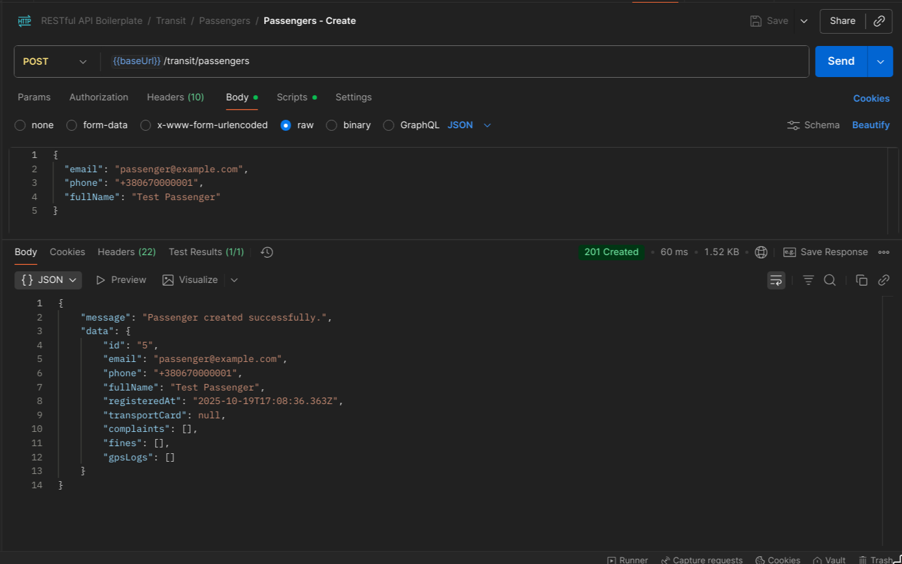
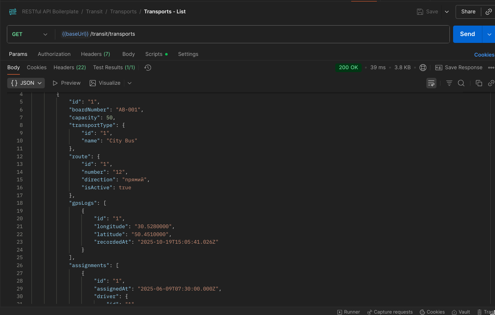

# TypeORM / Express / TypeScript RESTful API boilerplate

[![CI][build-badge]][build-url]
[![TypeScript][typescript-badge]][typescript-url]
[![prettier][prettier-badge]][prettier-url]

Boilerplate with focus on best practices and painless developer experience:

- Minimal setup that can be extended 🔧
- Spin it up with single command 🌀
- TypeScript first
- RESTful APIs (розширено модулем громадського транспорту)
- JWT authentication with role based authorization

## Transit Entities & Relationships

- **TransportType ↔ Route**: один вид транспорту обслуговує багато маршрутів (`TransportType` ←→ `Route`).
- **Route ↔ Transport / Schedule / RouteStop / RoutePoint / Trip**: маршрут об’єднує транспорт, розклад, послідовні зупинки та GPS-точки, а також поїздки.
- **Transport ↔ DriverAssignment / Trip / VehicleGpsLog**: конкретний транспорт має призначення водіїв, поїздки та GPS-логи.
- **Passenger ↔ TransportCard / ComplaintSuggestion / Fine / UserGpsLog**: пасажир володіє карткою, може купувати квитки, подавати скарги, отримувати штрафи і передавати координати.
- **Trip ↔ Ticket / ComplaintSuggestion / Fine**: поїздка поєднує маршрут, транспорт, водія, квитки та звернення пасажирів.

Усі сутності описані в `src/orm/entities/transit`, зв’язки реалізовані через декоратори TypeORM (`OneToMany`, `ManyToOne`, `OneToOne`) та відображені в міграції `src/orm/migrations/1760348623889-New_entitis.ts`.

## REST API Endpoints (`/v1/transit`)

- `GET /card-top-ups`, `GET /card-top-ups/:id`, `POST /card-top-ups`, `PATCH /card-top-ups/:id`, `DELETE /card-top-ups/:id`
- `GET /complaint-suggestions`, `GET /complaint-suggestions/:id`, `POST /complaint-suggestions`, `PATCH /complaint-suggestions/:id`, `DELETE /complaint-suggestions/:id`
- `GET /drivers`, `GET /drivers/:id`, `POST /drivers`, `PATCH /drivers/:id`, `DELETE /drivers/:id`
- `GET /driver-assignments`, `GET /driver-assignments/:id`, `POST /driver-assignments`, `PATCH /driver-assignments/:id`, `DELETE /driver-assignments/:id`
- `GET /fines`, `GET /fines/:id`, `POST /fines`, `PATCH /fines/:id`, `DELETE /fines/:id`
- `GET /fine-appeals`, `GET /fine-appeals/:id`, `POST /fine-appeals`, `PATCH /fine-appeals/:id`, `DELETE /fine-appeals/:id`
- `GET /passengers`, `GET /passengers/:id`, `POST /passengers`, `PATCH /passengers/:id`, `DELETE /passengers/:id`
- `GET /routes`, `GET /routes/:id`, `POST /routes`, `PATCH /routes/:id`, `DELETE /routes/:id`
- `GET /route-points`, `GET /route-points/:id`, `POST /route-points`, `PATCH /route-points/:id`, `DELETE /route-points/:id`
- `GET /route-stops`, `GET /route-stops/:id`, `POST /route-stops`, `PATCH /route-stops/:id`, `DELETE /route-stops/:id`
- `GET /schedules`, `GET /schedules/:id`, `POST /schedules`, `PATCH /schedules/:id`, `DELETE /schedules/:id`
- `GET /stops`, `GET /stops/:id`, `POST /stops`, `PATCH /stops/:id`, `DELETE /stops/:id`
- `GET /tickets`, `GET /tickets/:id`, `POST /tickets`, `PATCH /tickets/:id`, `DELETE /tickets/:id`
- `GET /transports`, `GET /transports/:id`, `POST /transports`, `PATCH /transports/:id`, `DELETE /transports/:id`
- `GET /transport-cards`, `GET /transport-cards/:id`, `POST /transport-cards`, `PATCH /transport-cards/:id`, `DELETE /transport-cards/:id`
- `GET /transport-types`, `GET /transport-types/:id`, `POST /transport-types`, `PATCH /transport-types/:id`, `DELETE /transport-types/:id`
- `GET /trips`, `GET /trips/:id`, `POST /trips`, `PATCH /trips/:id`, `DELETE /trips/:id`
- `GET /user-gps-logs`, `GET /user-gps-logs/:id`, `POST /user-gps-logs`, `PATCH /user-gps-logs/:id`, `DELETE /user-gps-logs/:id`
- `GET /vehicle-gps-logs`, `GET /vehicle-gps-logs/:id`, `POST /vehicle-gps-logs`, `PATCH /vehicle-gps-logs/:id`, `DELETE /vehicle-gps-logs/:id`

Кожний роут реалізує повний CRUD через узагальнені контролери (`src/controllers/transit`) та сервіси (`src/services/transit`). `ConfiguredCrudService` підключає `relations`, тому відповіді містять пов’язані сутності.

## Postman Evidence

## Requirements

- [Node v16+](https://nodejs.org/)
- [Docker](https://www.docker.com/)

## Running

_Easily set up a local development environment with single command!_

- clone the repo
- `npm run docker:dev` 🚀

Visit [localhost:4000](http://localhost:4000/) or if using Postman grab [config](/postman).

### _What happened_ 💥

Containers created:

- Postgres database container seeded with 💊 Breaking Bad characters in `Users` table (default credentials `user=walter`, `password=white` in [.env file](./.env))
- Node (v16 Alpine) container with running boilerplate RESTful API service
- and one Node container instance to run tests locally or in CI

## Features:

- [Express](https://github.com/expressjs/express) framework
- [TypeScript v4](https://github.com/microsoft/TypeScript) codebase
- [TypeORM](https://typeorm.io/) using Data Mapper pattern
- [Docker](https://www.docker.com/) environment:
  - Easily start local development using [Docker Compose](https://docs.docker.com/compose/) with single command `npm run docker:dev`
  - Connect to different staging or production environments `npm run docker:[stage|prod]`
  - Ready for **microservices** development and deployment.  
    Once API changes are made, just build and push new docker image with your favourite CI/CD tool  
    `docker build -t <username>/api-boilerplate:latest .`  
    `docker push <username>/api-boilerplate:latest`
  - Run unit, integration (or setup with your frontend E2E) tests as `docker exec -ti be_boilerplate_test sh` and `npm run test`
- Contract first REST API design:
  - never break API again with HTTP responses and requests payloads using [type definitions](./src/types/express/index.d.ts)
  - Consistent schema error [response](./src/utils/response/custom-error/types.ts). Your frontend will always know how to handle errors thrown in `try...catch` statements 💪
- JWT authentication and role based authorization using custom middleware
- Set local, stage or production [environmental variables](./config) with [type definitions](./src/types/ProcessEnv.d.ts)
- Logging with [morgan](https://github.com/expressjs/morgan)
- Unit and integration tests with [Mocha](https://mochajs.org/) and [Chai](https://www.chaijs.com/)
- Linting with [ESLint](https://eslint.org/)
- [Prettier](https://prettier.io/) code formatter
- Git hooks with [Husky](https://github.com/typicode/husky) and [lint-staged](https://github.com/okonet/lint-staged)
- Automated npm & Docker dependency updates with [Renovate](https://github.com/renovatebot/renovate) (set to patch version only)
- Commit messages must meet [conventional commits](https://www.conventionalcommits.org/en/v1.0.0/) format.  
  After staging changes just run `npm run commit` and get instant feedback on your commit message formatting and be prompted for required fields by [Commitizen](https://github.com/commitizen/cz-cli)

## Other awesome boilerplates:

Each boilerplate comes with it's own flavor of libraries and setup, check out others:

- [Express and TypeORM with TypeScript](https://github.com/typeorm/typescript-express-example)
- [Node.js, Express.js & TypeScript Boilerplate for Web Apps](https://github.com/jverhoelen/node-express-typescript-boilerplate)
- [Express boilerplate for building RESTful APIs](https://github.com/danielfsousa/express-rest-es2017-boilerplate)
- [A delightful way to building a RESTful API with NodeJs & TypeScript by @w3tecch](https://github.com/w3tecch/express-typescript-boilerplate)

[build-badge]: https://github.com/mkosir/express-typescript-typeorm-boilerplate/actions/workflows/main.yml/badge.svg
[build-url]: https://github.com/mkosir/express-typescript-typeorm-boilerplate/actions/workflows/main.yml
[typescript-badge]: https://badges.frapsoft.com/typescript/code/typescript.svg?v=101
[typescript-url]: https://github.com/microsoft/TypeScript
[prettier-badge]: https://img.shields.io/badge/code_style-prettier-ff69b4.svg
[prettier-url]: https://github.com/prettier/prettier

## Contributing

All contributions are welcome!
